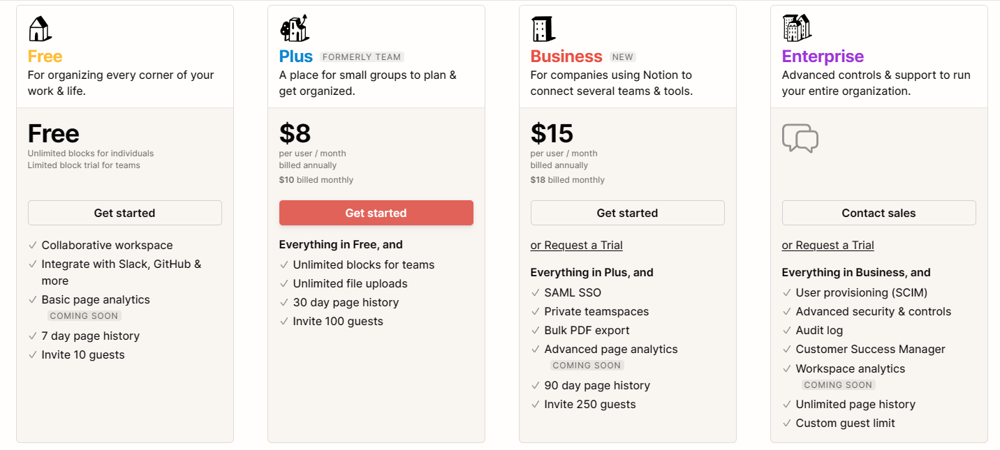

<!--more-->

> 注明：本系列教程翻译自[Notion 官方教程](https://www.notion.so/help/guides)，非完全翻译，只挑选重要的内容。

Notion 是一系列的块,用来创建你喜欢的东西。例如：

- 文档
- 数据库
- 公共站点
- 知识库
- 项目管理系统
- 世界上最美丽的笔记本...😉

## 什么是块

把 Notion 想象成一堆砖块，你在 Notion 中创建的每个页面都由很多块组成，创建页面像堆乐高积木。

### Notion中的一切都是块

当你创建第一个页面然后输入文字时，就开始了一个文本块，Notion 能包括很多文本块。

你添加到页面的每个内容（文本，图片，表格）都是一个 块，每个页面是由很多块按你想要的方式组合而成。

下面是一个页面，指出了页面中不同类型的 块

### 转换块的类型

任何 块 能转成其它类型的 块，方便你使用和浏览。

通过单击 块 左侧的符号`⋮⋮`（块句柄）来操作，在弹出菜单中，选择您想要转换成的内容。
<video autoplay loop style="width:100%" src="https://videos.ctfassets.net/spoqsaf9291f/2DiOYKAi904jz53tJvfVwx/7699ac37ce85eb2b0fa944428cb4bc6e/Turn_into.mp4" >
### 重新排列块

拖动块句柄来排序
<video autoplay loop style="width:100%" src="https://videos.ctfassets.net/spoqsaf9291f/7Frnrb6PPUqSvJkCFFo0uP/78264c9a2135ffe6855d843cc6ada0bb/Rearrange.mp4" >
## 创建Page

你在Notion创建的每个Page都是一个新的Canvas，在Page里能随心所欲的添加block，跟随下面的几个操作来创建你的第一个Page吧。📄

### 新增Page

由两种方式新增页面：
* 点击屏幕左下角的 `+ New page`
* 快捷键 `cmd/ctrl + N`

新增后弹出一个页面，里面有一些模板和Page类型

现在，给页面一个标题，然后你将得到一个新的空白页面，按`enter`键
<video autoplay loop style="width:100%" src="https://videos.ctfassets.net/spoqsaf9291f/8OWBURBJcbGefqCwFRnda/936b82e0060cc286c2ac8fab28075120/New_page_typing.mp4" >

### 开始写

开始输入内容吧，鼠标选中高亮时，能够添加超链接或注释，或者以粗体、斜体、下划线等设置文本样式。

### `/` 斜杠命令
类似于钉钉的功能，斜杠开始选择一个你想要的block
<video autoplay loop style="width:100%" src="https://videos.ctfassets.net/spoqsaf9291f/3HVip8XgcEoqQcYZrraMRN/82b86f85e85e0196be660f116ec1fe82/slash_command.mp4" >

## 创建一个次级页面

**Notion没有文件夹**，不过你能给页面添加次级页面。

### 新增一个次级页面
在页面中，输入`/page`命令
* 你将立刻看到一个空吧的页面，给它一个标题，开始输入内容吧。
* 当你返回到页面中，你将看到新建的次级页面。
<video autoplay loop style="width:100%" src="https://videos.ctfassets.net/spoqsaf9291f/3WXrgzszWHqiuAt5RJxDzi/2406c0ad917518db102a805a1799d34e/Create_subpage.mp4" >

### 侧边栏和导航条
你能从侧边栏直接创建次级页面
* 点击工作空间左上角`≡`按钮打开侧边栏
* 悬浮到一个页面上，点击页名右侧的`+`按钮，将立刻创建一个次级页面
<video autoplay loop style="width:100%" src="https://videos.ctfassets.net/spoqsaf9291f/6VB1Qri8AWKvMNd7aTP5BE/31ca257d0b51c234fb9f04beeacde453/Subpage_from_sidebar.mp4" >

创建好后，将在侧边栏看到新建的次级页面。

### 重排页面结构
拖动即可重排。
<video autoplay loop style="width:100%" src="https://videos.ctfassets.net/spoqsaf9291f/2UK1LnwlcFC2sztqXHgdPZ/88aa6eaadb9638d06ff047619c630b5b/Nesting___unnesting_subpages.mp4" >

## 什么是数据库

数据库是Notion的核心特征，用来管理组织页面结构。

### 数据库是页面集合
每个数据库都是一个容器，让你用一种简单的方式组织很多页面，下面截图中，每一行是一个页面。

这给你一个页面的鸟瞰图。当你想深入了解页面是什么时，每行页面都能点击打开。
<video autoplay loop style="width:100%" src="https://videos.ctfassets.net/spoqsaf9291f/5wS20G6X8IxVrfa2dhKl5h/bceab1f73baefb2d1605fd76300ef0b1/Open_database_page.mp4" >

### 数据库也是一个页面
这意味着，你能任意的嵌套数据库到其它页面中，像操作页面一样。
<video autoplay loop style="width:100%" src="https://videos.ctfassets.net/spoqsaf9291f/3QZJh2b6yNQGIpy2DdqeRN/ba6ce9b0f3972a86cc51c56327be1735/Nest_database.mp4" >

### 数据库有一些属性
你能给每个数据项添加一些属性，然后按属性过滤，搜索，排序。

### 数据库有多种视图

## 创建一个数据库

### 创建一个表格
* 新建一个页面，选择表格
* 第一个列是页名，之后的每一列对应一个赋予的属性值
<video autoplay loop style="width:100%" src="https://videos.ctfassets.net/spoqsaf9291f/40BE2Sw1gbfABgvimhHuHR/2a4f0201cce9f03ff31f9882efecf27f/New_database.mp4" >

点击一个属性头，然后在`property type`下面是你能选择的属性值类型

### 新增一条数据到表格里
* 创建一个任务数据库
* 增加一些任务
* 使用`multi-select`属性新增一些值到`Tags`列，建议：p1,p2,p3来表示任务的优先级

* 点击`tags`右侧的`+`来新增更多的属性
* 把属性名改成`Due Date`，在属性菜单里选择`Date`，点击单元格就能弹出时间选择框。
<video autoplay loop style="width:100%" src="https://videos.ctfassets.net/spoqsaf9291f/hSvk3IL5t1WEzruyDCD7Z/1d923ea5c5239f3cd12453a50b3db3cf/New_property.mp4" >

### 从表格中打开页面
你能搜索，过滤属性值
鼠标悬浮到`Name`列，点击`Open`按钮即可打开。
<video autoplay loop style="width:100%" src="https://videos.ctfassets.net/spoqsaf9291f/3s6uePrIusXuKOdFlHkqIb/19745883bb55a1a010a2818d512e251e/Open_database_page.mp4" >

* 你能新增或编辑任何属性，你也能增加额外的内容的页面中，比如任务详情。

### 创建一个新的数据库视图
你能为相同的数据创建不同的视图，你能将其放到看板，日历，列表，图库或时间线中。
* 点击表格左上角
* 为新视图命名，然后从右侧菜单中选择。`Board`
* 这会将表格中的行显示成卡片，点击卡片仍能打开页面。
<video autoplay loop style="width:100%" src="https://videos.ctfassets.net/spoqsaf9291f/7fEXn8aF3uQVfMWeBz5y3r/cada58771337e599125dced0c721f119/Add_view.mp4" >

### 筛选和排序
按属性筛选。
* 点表格顶部的`filter`按钮
* 选择需要满足的条件
<video autoplay loop style="width:100%" src="https://videos.ctfassets.net/spoqsaf9291f/5HmfNS3K8g9PViDapl6H92/7b429a818cea268045962a6600f32404/New_DB_filter.mp4" >

能按优先级，日期，标签等快速排序
<video autoplay loop style="width:100%" src="https://videos.ctfassets.net/spoqsaf9291f/7guHNuEzDmq2xIP5GtgDUZ/512750bd751676b3dad8af32076ee9bf/New_DB_sort.mp4" >

可以添加任意数量的筛选和排序

-----------

## 价格

免费额度只能上传5MB的文件。

## 未完，待续...
